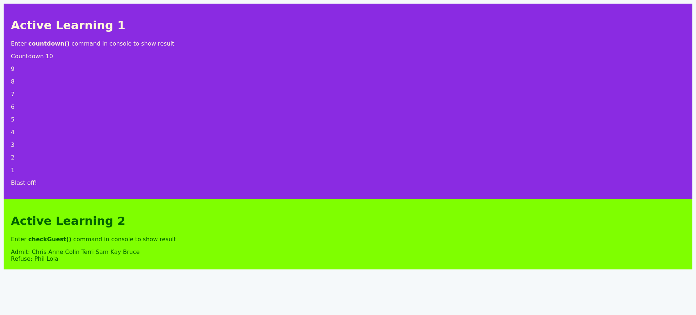

# MDN Loop Demo

This is a solution to the [Active learning exercises from Looping Code topic in MDN Web Docs](https://developer.mozilla.org/en-US/docs/Learn/JavaScript/Building_blocks/Looping_code). The objective was to understand how to use loops in JavaScript.

## Table of contents

- [Overview](#overview)
  - [The challenge](#the-challenge)
  - [Screenshot](#screenshot)
  - [Links](#links)
- [My process](#my-process)
  - [Built with](#built-with)
  - [What I learned](#what-i-learned)
  - [Continued development](#continued-development)
  - [Useful resources](#useful-resources)
- [Author](#author)

## Overview

### The challenge

For the first exercise, I had to print out a simple launch countdown from 10 down to Blastoff. On the next exercise, I have taken a list of names stored in an array and put them into a guest list while excluding names of guests to refuse.

### Screenshot



### Links

- Live Site URL: [Github Page](https://code-mma.github.io/mdn-loop/)

## My process

### Built with

- Semantic HTML5 markup
- CSS custom properties

### What I learned

From these exercises, I applied my knowledge in JavaScript loops which includes the ```for...of``` and ```while``` loops.

### Continued development

Future modification includes adding buttons to activate a specific output and also visuals.

### Useful resources

- [The Odin Project](https://www.theodinproject.com) - The site that guided me to become better at frontend development.

## Author

- GitHub Profile - [Michael Angelo](https://github.com/code-mma)